---
author: Cher Ma, Emily Chin
geometry: margin=1in
fontsize: 12pt
--- 

# Lab 1

Interaction Design Lab 01

Cher Ma and Emily Chin

Fall 2021

## Design Decisions
<!-- your design decisions, including their rationale (include images) -->

We went with a simple and user-friendly design. We added a textfield at the top for the user to add tasks. The textfield had a placeholder "New Task", so the user knows exactly what it's for.  We also made each of the tasks in the list be in textboxes so they could easily be editted. The buttons are easy to understand and use. The trashcan icon is a simple and clean way to indicate that button is used for deleting a task.

## Alternative Designs
<!-- alternative designs you considered, including images -->

We considered using an underline to separate the title from the task list, but it did not look as clean, so we opted to placed the title in a header box with a blue background instead. We also tried different paddings and margins for each of the elements until we got the final version which looked the best to us. 

## User Testing
<!-- any user testing you did -->

We plan to do user testing when we make the app more functional. 

## Final Design
<!-- the final design, including screen images and the flow for each task. -->

For the first bullet, the screen starts with just the header, footer, a textbox with placeholder "New Task" and an add button. Then, the user can add the text into the textbox and the final screen shows the added task as a bulletpoint with a checkbox. 

### Designs
|                         |                         |                         |
|:-----------------------:|:-----------------------:|:-----------------------:|
|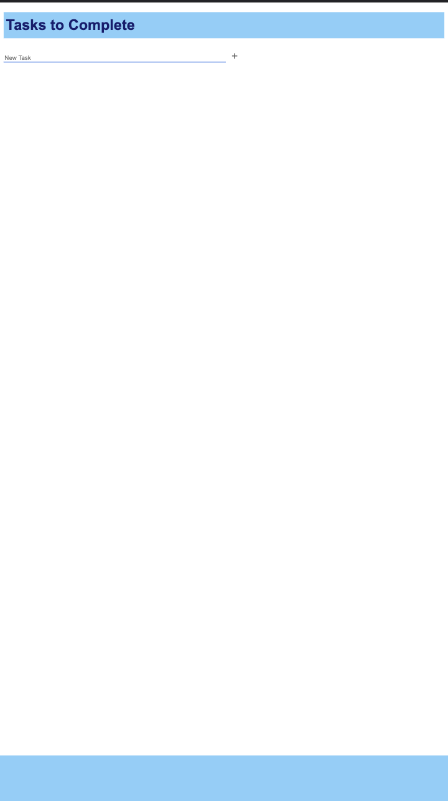 Before |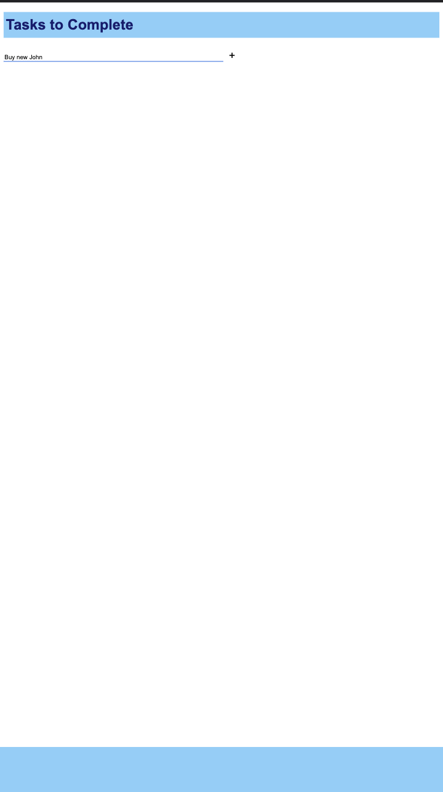 During |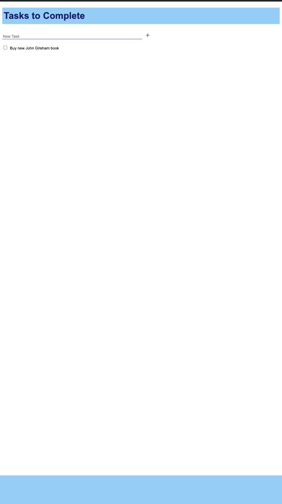 After |
| Before | During |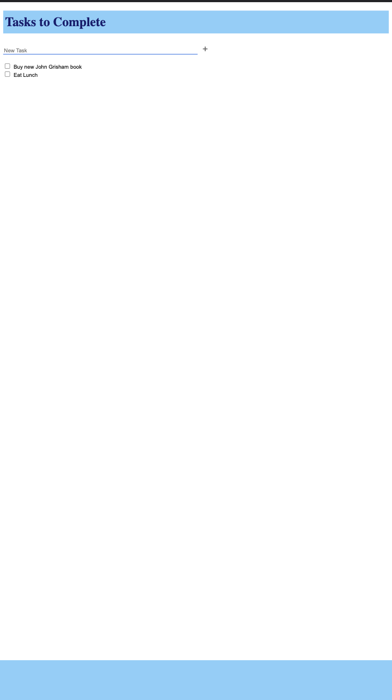 After |
|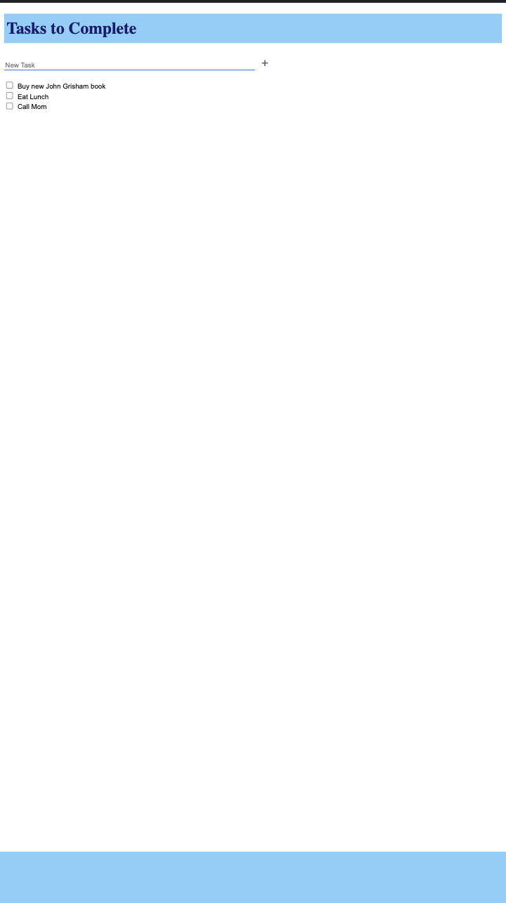 Before | NA |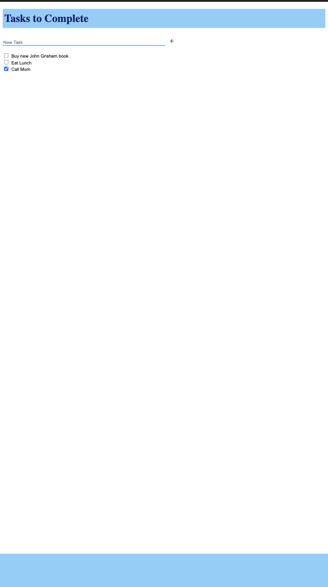 After |
|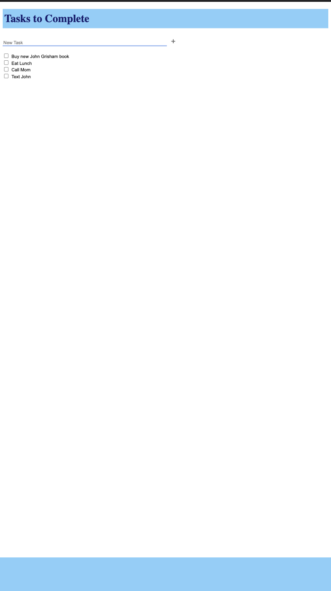 Before | During |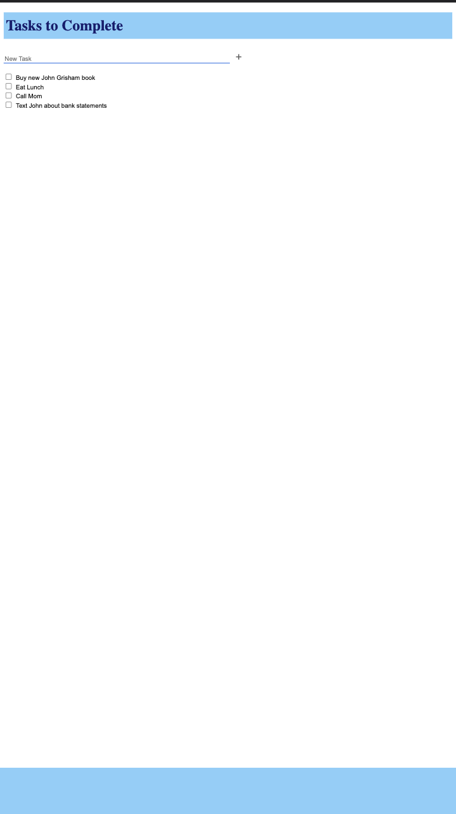 After |
|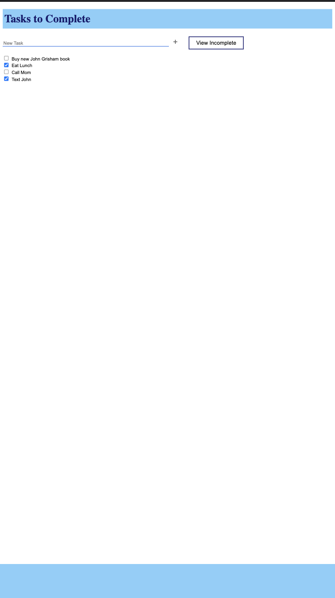 Before | NA |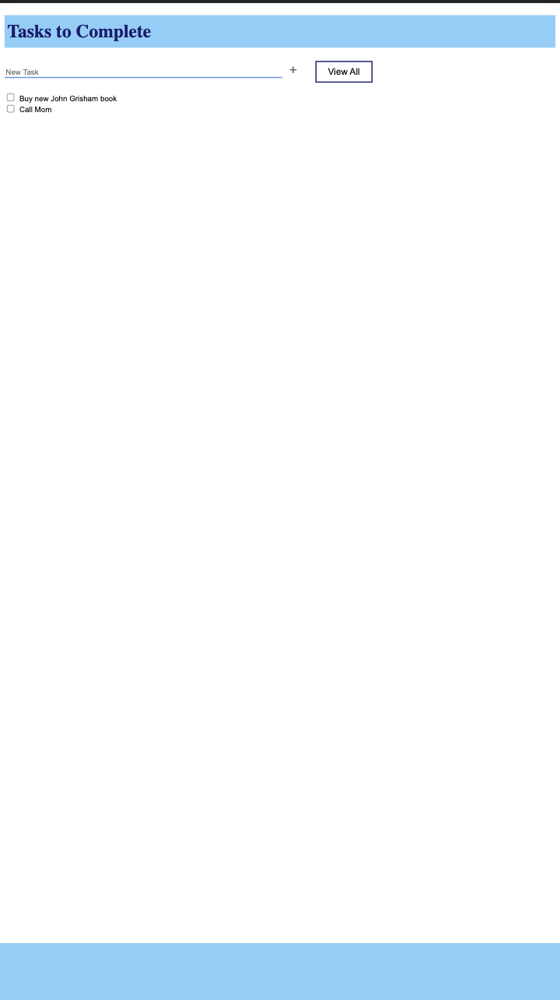 After |
|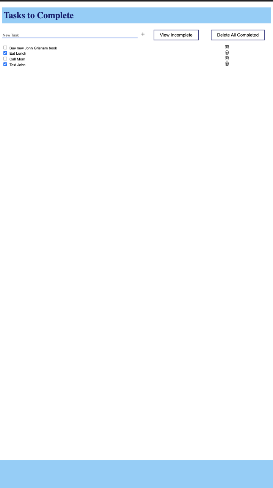 Before | NA |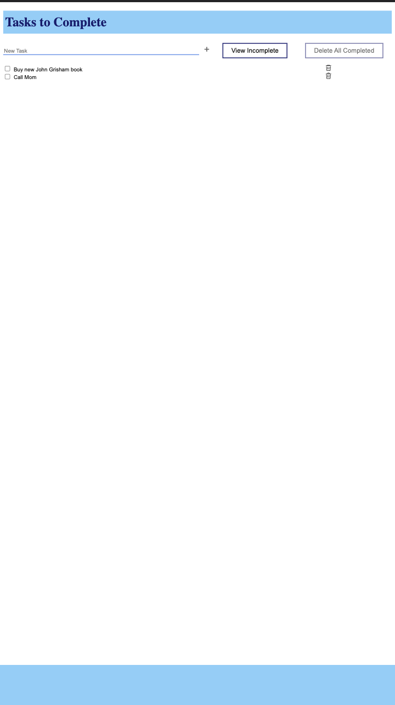 After |

## Challenges
<!-- challenges you faced -->

We wanted to remove the border of the texboxes when clicked, but setting the border to none did not work. We had to set outline to none as well. It took us a while to figure that out. 

## Most Proud
<!-- parts of the design you're most proud of -->

We are proud of figuring out how to add a trashcan icon.
