# Lab 4

Interaction Design Lab 04

Cher Ma and Emily Chin

Fall 2021

View website here: https://cherrymar.github.io/cs124/

Link to Video: https://youtu.be/Ns_smO6_zzA

## Design Decisions
<!-- your design decisions, including their rationale (include images) -->
We went for a clean and minimalistic approach for the design. We added a menu that lists all the different task lists the user has. On the mobile view, the menu is displayed as the starting screen. On the desktop view, the menu is shown on the side. Once the desired task list is selected, on the mobile view, the screen shifts over to the task list. On the desktop view, the task list appears next to the menu. On the task list and the menu, there is a text field at the top of the page, above any existing tasks or lists. There is a placeholder "New Task" or "New Task List" to indicate where the user can input. Next to the "New Task" field, there are also stars that the user can select 0-3 of in order to indicate priority levels. Once there is text in the field, the "Add" button becomes enabled and the user can add to the list. This also prevents the user from accidentally adding an empty text field. In the menu, when a new list is added, a new button with the corresponding name is added under the existing lists. In the task list, each existing task is also put in a text field to be easily edited, along with the initial priority rating that can be edited as well, and has a trashcan next to it, as a simple indicator for deleting the task. We opted for an automatically expanding text area (depending on how many lines of text there are) rather than a scrollable text area that is difficult to see. Each of the tasks also feature a checkbox to indicate completion and there is a button at the end of the list to delete all the completed tasks. This button is disabled when there are no tasks that are completed. There is also a warning alert when the "Delete Completed" button is pressed to ensure that the user actually meant to press that button. Above all the existing tasks, there are tabs that easily switch the views between all tasks, completed tasks, and tasks that are not yet completed. We also included a dropdown menu, so that the user can easily choose between three available sort options: date created, name of the task, and priority. We also added aria-labels to certain features to make the screen-reader functionality better. We also ensured that the whole app is funtional using the keyboard. You can tab into each section and use the spacebar/enter keys to select or use the arrows to set the priority levels. Finally, when the user zooms in enough on the desktop screen, the view automatically changes to the mobile format where the menu is on a different page.

## Alternative Designs
<!-- alternative designs you considered, including images -->
We tried different paddings, margins, font sizes, and placements until we got the clean look we wanted that was balanced and easy to use. We also tried different text field and button styles. We also considered having three buttons instead of the dropdown menu, but we found that the dropdown was cleaner and looked better. We changed our text field components to expandable text field components to allow for easy viewing of task descriptions. We 
started with our own components, but we ended up using several components from Material UI which gave our app a more cohesive and sophisticated look. 

We also considered having two dropdown menus for sorting and filtering, but we found that that looked messy, so we opted to make one of them tabs. We also tried different placementsfor the stars, such as below that task, but we found that putting them next to the task was cleaner.

When designing the placement of the menu, we considered having two tabs where one is the menu and one is the current list, but that did not seem to be necessary since we could just use the back button instead. We also considered having the menu be a pop up, but we felt that this design made more sense and was easier to use.

## User Testing
<!-- any user testing you did -->

We asked two people to test our app. Some issues they faced and some feedback for 
improvement include:
- unable to retrieve accidentally deleted tasks
- user drag and drop sorting
- a way to sort the lists in the menu
- some confusion about the disabled "add" button but figured it out after a bit
- some confusion as to whether the "delete all completed tasks" button is for current list or all lists

On the other hand, some features that were easy to use and understand include:
- the underline under New Task and New Task List that indicates the user can start typing
- editing existing tasks and priority levels
- deleting tasks
- delete all completed tasks
- sorting
- switching the filtered views
- switching the lists using the menu
- intuitive design

## Final Design
<!-- the final design, including screen images and the flow for each task. -->

### Designs
(In the first set images of our designs, they don't show that we included "Sort By" next to the dropdown menu on the top.)
<!-- Bullet 1 -->
|                         |                         |                         |
|:-----------------------:|:-----------------------:|:-----------------------:|
|  |  |  |

|                         |                         |                         |
|:-----------------------:|:-----------------------:|:-----------------------:|
|Before: The screen starts with just the header, New Task field, blank star ratings, tab bar, dropdown menu, and disabled "Add". There is a disabled "Delete Completed" button on the bottom as well.| During: As the user is typing the new task, the "Add" button becomes active. | After: Once the user has added, the New Task field is cleared and the "Add" button is once again disabled. The new task is added into the task list below along with the selected priority. |

<!-- Bullet 2 -->
|                         |                         |                         |
|:-----------------------:|:-----------------------:|:-----------------------:|
|  |  |  |

|                         |                         |                         |
|:-----------------------:|:-----------------------:|:-----------------------:|
|Before: We start with a non empty list. The other features remain the same as the after version of the previous bullet. | During: The user starts typing the new task and the "Add" button is active. | After: We have an additional task added to the task list. The "Add" button is disabled again. |

<!-- Bullet 3 -->
|                         |                         |
|:-----------------------:|:-----------------------:|
|  |  |

|                         |                         |                         |
|:-----------------------:|:-----------------------:|:-----------------------:|
|Before: We have a non empty list that includes the task "Buy book for class".  | After: When the user clicks the checkbox, the box is checked (or unchecked if already checked). Since this was the first item in the list that was checked, doing so also enabled the "Delete Completed" button.|

<!-- Bullet 4 -->
|                         |                         |                         |
|:-----------------------:|:-----------------------:|:-----------------------:|
|  | 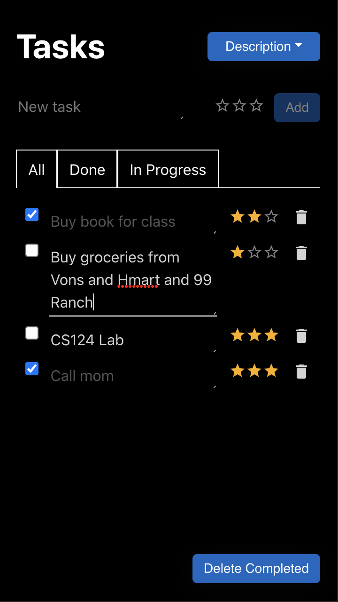 | 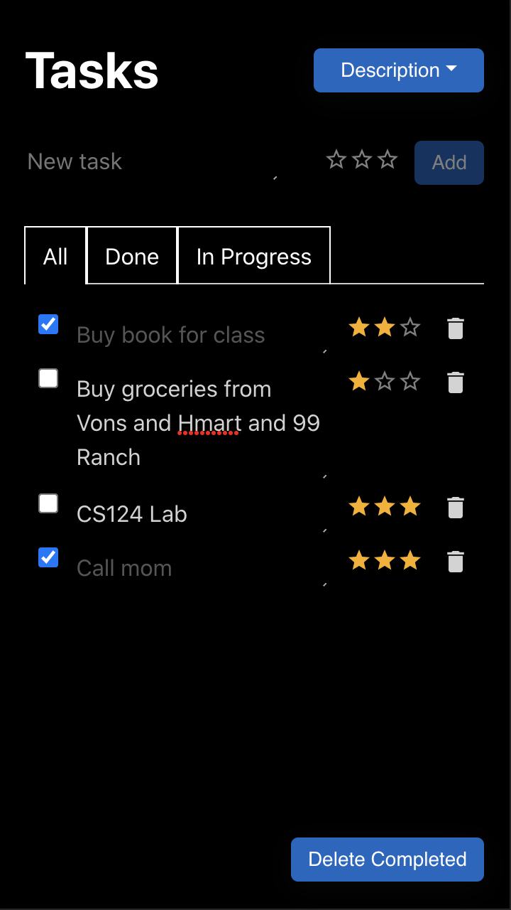 |

|                         |                         |                         |
|:-----------------------:|:-----------------------:|:-----------------------:|
|Before: We start with a non empty list. | During: When the user clicks on a task, it focuses the textbox so that the user can edit the task description. | After: When the user clicks outside of the textbox, the task is updated with the new description. |

<!-- Bullet 5 -->
|                         |                         |                         |
|:-----------------------:|:-----------------------:|:-----------------------:|
|  | 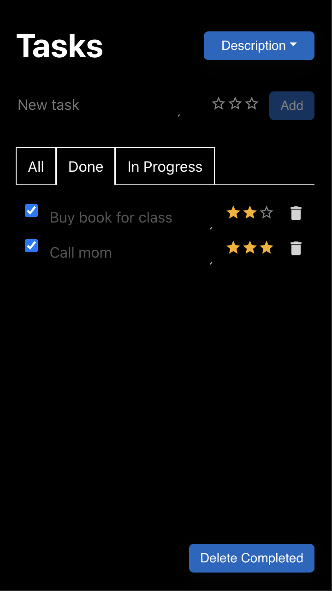 | 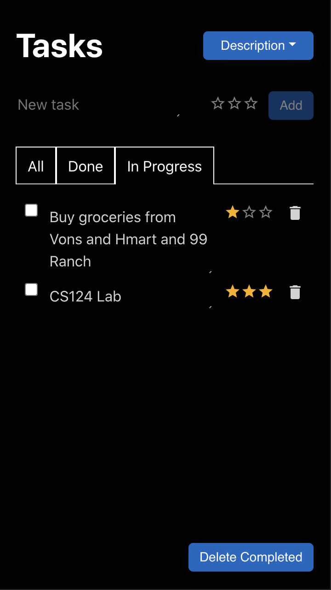 |

|                         |                         |                         |
|:-----------------------:|:-----------------------:|:-----------------------:|
|Before: We start with a task list where some items are checked. | Done: When the user selects "Done" from the tab bar, the list shows a filtered view of only tasks that have not been checked.| In Progress: When the user selects "In Progress" from the tab bar, the list shows a filtered view of only tasks that have not been checked.|

<!-- Bullet 6 -->
|                         |                         |                         |
|:-----------------------:|:-----------------------:|:-----------------------:|
|  |  |  |

|                         |                        |                         |
|:-----------------------:|:-----------------------:|:-----------------------:|
| Before: We start with a task list where some items are checked. | During: When the "Delete Completed" button is clicked, a modal alert warning shows up to make sure the user actually wants to delete all completed tasks before deleting. | After: When the user clicks the "Delete Completed" button, all checked tasks are deleted from the list. Then, the "Delete Completed" button is disabled once again. |

<!--  -->
|                         |                        |                         |
|:-----------------------:|:-----------------------:|:-----------------------:|
|  |  |  |

|                         |                        |                         |
|:-----------------------:|:-----------------------:|:-----------------------:|
| Sort By: Date Created | Sort By: Name | Sort By: Priority |

<!-- Multiple Lists -->
|                         |                        |                         |
|:-----------------------:|:-----------------------:|:-----------------------:|
| 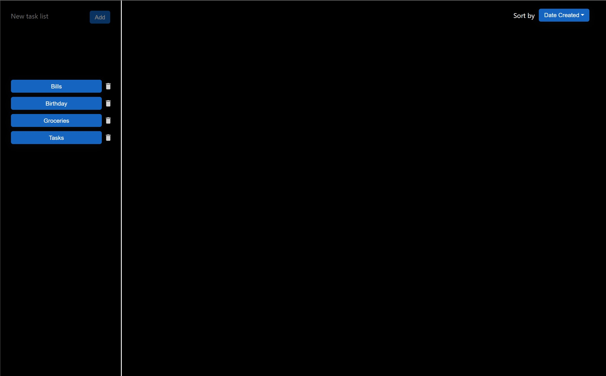 | 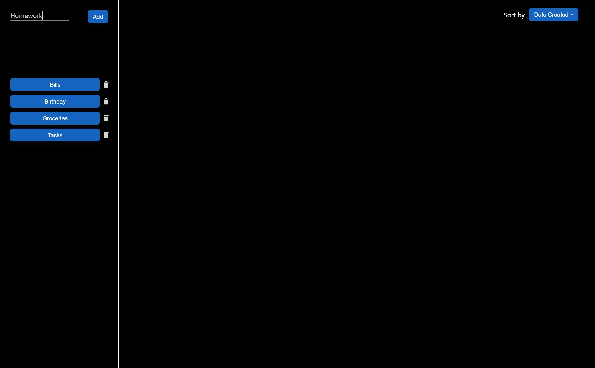 | 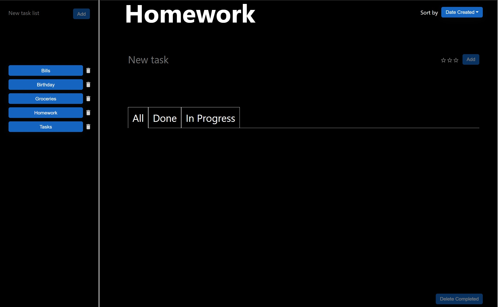 |

|                         |                        |                         |
|:-----------------------:|:-----------------------:|:-----------------------:|
| Before: When we first open the application, we start off with just the menu on the left and no tasks displayed. | During: The user can add a new list to the menu by typing its name in the text field. | After: The user clicks "Add" and the new list is added to the menu as a button and the list opens up on the right. |

<!-- Multiple Lists -->
|                         |                        |                         |                         |
|:-----------------------:|:-----------------------:|:-----------------------:|:-----------------------:|
| 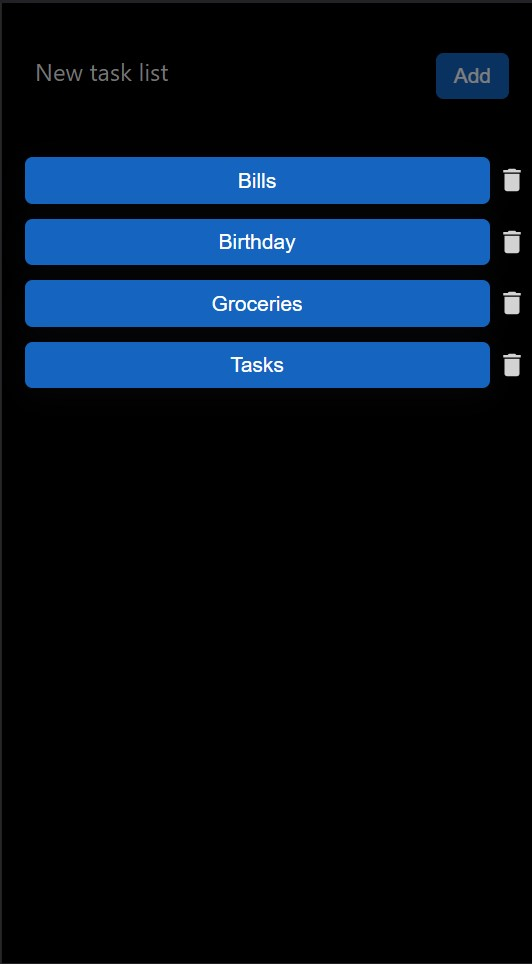 | 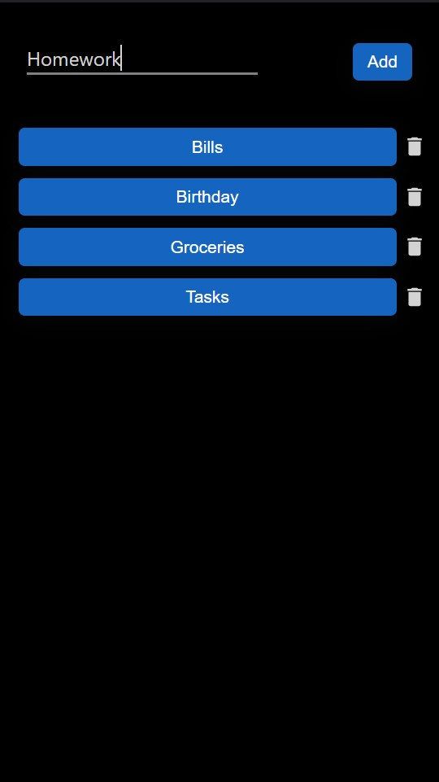 | 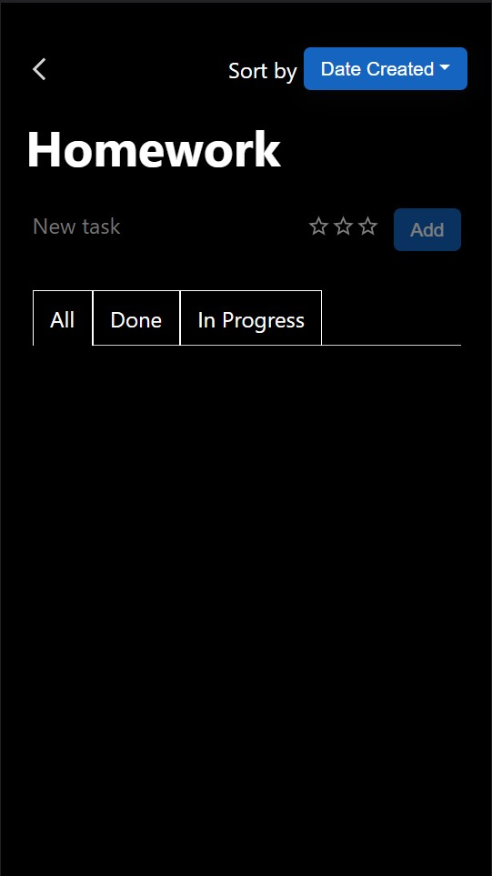 | 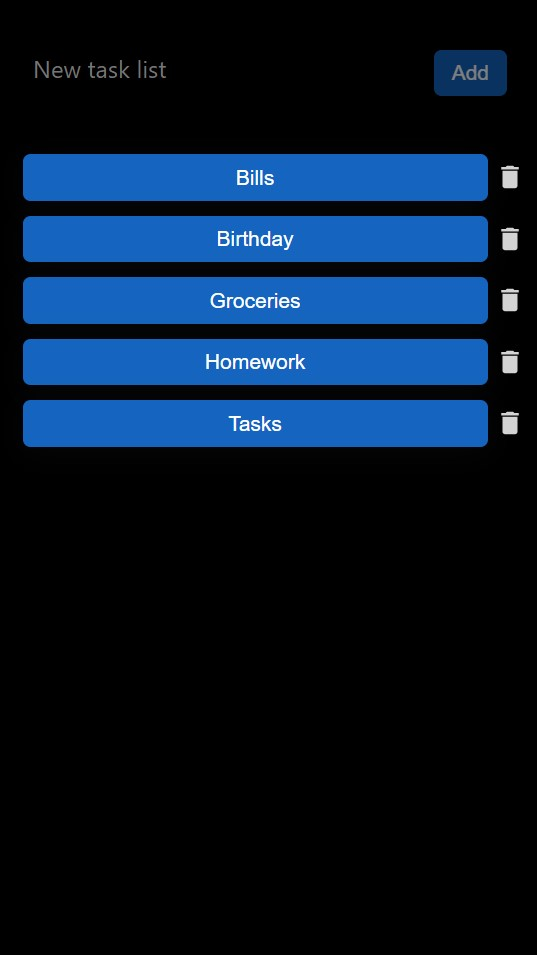 |

|                         |                        |                         |                         |
|:-----------------------:|:-----------------------:|:-----------------------:|:-----------------------:|
| Before: When we first open the application, we start off with just the menu and the list of existing lists displayed. | During: The user can add a new list to the menu by typing its name in the text field. | After: The user clicks "Add" and the task list with the new title is shown. | After 2: The new list is also added to the menu as a button. |

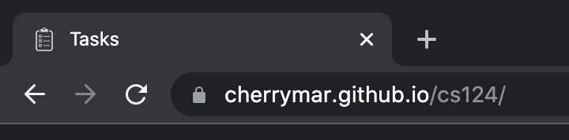

We added a checklist icon as a logo and added a title on the brower window. 

## Challenges
<!-- challenges you faced -->
Some of the challenges we faced include trying to incorporate features from external 
react packages. It would take us several tries to find the right ones to use that 
would give us the look that we wanted. We also struggled with how to present the 
buttons (text vs an icon and text length) to make the buttons easy to understand and 
use. We also struggled to customize external packages to look and act the exact way we 
wanted to. 

We also struggled with saving the date created in a format that we could easily access
and displaying the list of tasks appropriately with the selected sort option and filter. Some other difficulties included figuring out how to pass around the data, when and where we should do this. 

Another thing we struggled with as storing the different task lists into Firestore efficiently. We also struggled with making the accessibility features user friendly.

## Most Proud
<!-- parts of the design you're most proud of -->
We are proud of figuring out how to incorporate different icons and components from 
the react packages into our project. We are also proud of how userfriendly our app is. 
Overall, we believe this iteration of the app is much more visually pleasing than 
before. 

We also think that this new iteration of the app is clearer and the icons are aligned 
better. Another thing we are proud of is figuring out how to disable certain buttons that
shouldn't be used at times and also implementing the stars to indicate priority levels. We were able to customize several more elements which gives our app a more cohesive look than before. 

We are also proud of being able to incoporate different styles for different views and screen sizes. Another thing we are proud of is figuring out how to efficiently store the data in Firestore.