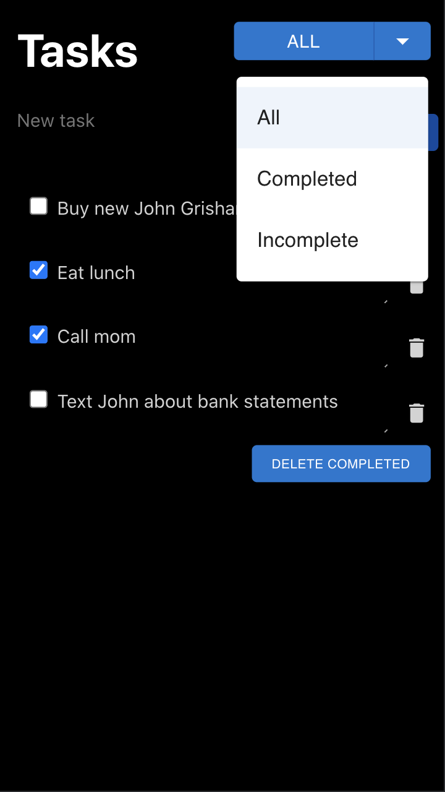

# Lab 1

Interaction Design Lab 02

Cher Ma and Emily Chin

Fall 2021

## Design Decisions
<!-- your design decisions, including their rationale (include images) -->

We went for a clean and minimalistic approach for the design. There is a text field at the top of the page, above any existing tasks. There is a placeholder "New Task" to indicate where the user can input. Once there is text in the field, the "Add" button appears and the user can add the task to the list. This also prevents the user from accidentally adding an empty text field as a task. Each existing task is also put in a text area to be easily edited and has a trashcan next to it, as a simple indicator for deleting the task. We opted for a text area instead of a text field to account for long tasks. This allows the whole text to be displayed rather than a one liner that is difficult to scroll through. Each of the tasks also feature a checkbox to indicate completion and there is a button at the end of the list to delete all the completed tasks. There is also a warning alert when the "Delete Completed" button is pressed to ensure that the user actually meant to press that button. Lastly, we also included a dropdown menu, so that the user can easily choose between three available views: all tasks, completed tasks, and incomplete tasks. 

## Alternative Designs
<!-- alternative designs you considered, including images -->

We tried different paddings, margins, font sizes, and placements until we got the clean look we wanted that was balanced and easy to use. We also tried different text field and button styles. We also considered having three buttons instead of the dropdown menu, but we found that the dropdown was cleaner and looked better. We changed our text field components to text area components to allow for easy viewing of task descriptions. We started with our own components, but we ended up using several components from Material UI which gave our app a more cohesive and sophisticated look. 

## User Testing
<!-- any user testing you did -->

We asked two people to test our app. Some issues they faced and some feedback for improvement include:
- not noticing the new task initially because it was too subtle
- unable to retrieve accidentally deleted tasks
- can't use the enter button to add a task
- has trouble scrolling because of the small text field
- the dropdown was confusing because it looked like different folders that the user can add to
- the style of the warning alert doesn't match the style of the rest of the app

On the other hand, some features that were easy to use and understand include:
- the underline under New Task that indicates the user can start typing
- editing existing tasks
- deleting tasks

## Final Design
<!-- the final design, including screen images and the flow for each task. -->

### Designs
<!-- Bullet 1 -->
|                         |                         |                         |
|:-----------------------:|:-----------------------:|:-----------------------:|
|  |  |  |

|                         |                         |                         |
|:-----------------------:|:-----------------------:|:-----------------------:|
|Before: The screen starts with just the header, New Task field, dropdown menu, and disabled "Add". | During: As the user is typing the new task, the "Add" button becomes active. | After: Once the user has added, the New Task field is cleared and the "Add" button is once again disabled. The new task is added into the task list below. |

<!-- Bullet 2 -->
|                         |                         |                         |
|:-----------------------:|:-----------------------:|:-----------------------:|
|  |  |  |

|                         |                         |                         |
|:-----------------------:|:-----------------------:|:-----------------------:|
|Before: We start with a non empty list. The other features remain the same as the before version of the previous bullet. | During: The user starts typing the new task and the "Add" button is active. | After: We have an additional task added to the bottom of the task list. |

<!-- Bullet 3 -->
|                         |                         |
|:-----------------------:|:-----------------------:|
|  |  |

|                         |                         |                         |
|:-----------------------:|:-----------------------:|:-----------------------:|
|Before: We have a non empty list that includes the task "Call Mom".  | After: When the user clicks the checkbox, the box is checked (or unchecked if already checked). |

<!-- Bullet 4 -->
|                         |                         |                         |
|:-----------------------:|:-----------------------:|:-----------------------:|
|  |  |  |

|                         |                         |                         |
|:-----------------------:|:-----------------------:|:-----------------------:|
|Before: We start with a non empty list with "Text John". | During: When the user clicks on the task, it focuses the textbox so that the user can edit the task description. | After: When the user clicks outside of the textbox, the task is updated with the new description "Text John about bank statements". |

<!-- Bullet 5 -->
|                         |                         |                         |
|:-----------------------:|:-----------------------:|:-----------------------:|
|  |  |  |

|                         |                         |                         |
|:-----------------------:|:-----------------------:|:-----------------------:|
|Before: We start with a task list where some items are checked. | During: A dropdown menu appears at the top for choosing a specific view. | After: When the user selects "Incomplete" from the dropdown menu, the list shows a filtered view of only tasks that have not been checked.|

<!-- Bullet 6 -->
|                         |                         |                         |
|:-----------------------:|:-----------------------:|:-----------------------:|
|  |  |  |

|                         |                        |                         |
|:-----------------------:|:-----------------------:|:-----------------------:|
| Before: We start with a task list where some items are checked. | During: When the "Delete Completed" button is clicked, a modal alert warning shows up to make sure the user actually wants to delete all completed tasks before deleting. | After: When the user clicks the "Delete Completed" button, all checked tasks are deleted from the list. |

## Challenges
<!-- challenges you faced -->

Some of the challenges we faced include trying to incorporate features from external react packages. It would take us several tries to find the right ones to use that would give us the look that we wanted. We also struggled with how to present the buttons (text vs an icon and text length) to make the buttons easy to understand and use. We also struggled to customize external packages to look and act the exact way we wanted to. 

## Most Proud
<!-- parts of the design you're most proud of -->

We are proud of figuring out how to incorporate different icons and components from the react packages into our project. We are also proud of how userfriendly our app is. Overall, we believe this iteration of the app is much more visually pleasing than before. 
